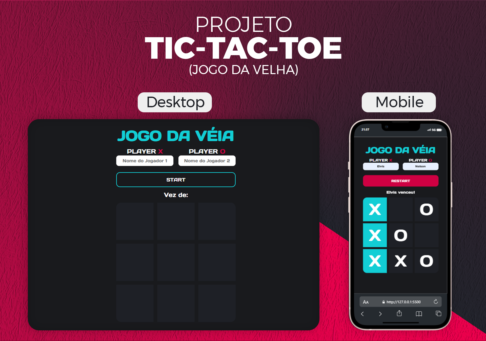

<h1 align="center">Projeto TIC-TAC-TOE</h1>

  <a href="#-tecnologias">Tecnologias</a>&nbsp;&nbsp;&nbsp;|&nbsp;&nbsp;&nbsp;
  <a href="#-projeto">Projeto</a>&nbsp;&nbsp;&nbsp;|&nbsp;&nbsp;&nbsp;
  <a href="#-layout">Layout</a>

 

  

## 🚀 Tecnologias

Esse projeto foi desenvolvido com as seguintes tecnologias:

- HTML e CSS
- JavaScript
- Git e Github

## 💻 Projeto

Este projeto de Jogo da Velha foi desenvolvido como parte do curso da OneBitCode, com algumas adaptações de design para proporcionar uma experiência mais agradável e dinâmica. Inspirado no clássico jogo da velha, o projeto incorpora funcionalidades adicionais, como a personalização dinâmica do botão de início/reinício do jogo.

Funcionalidades Principais:

- Design Aprimorado: O jogo apresenta um design atraente e amigável, inspirado em elementos de jogos, proporcionando uma experiência visualmente agradável.
- Nomes Personalizados: Os jogadores têm a liberdade de inserir seus nomes antes do início do jogo, tornando a experiência mais personalizada.
- Botão Dinâmico: O botão de início/reinício do jogo altera seu texto e cor, indicando claramente o estado atual do jogo.
- Vitória e Empate: O jogo detecta automaticamente quando um jogador vence ou se a partida termina em empate, proporcionando uma experiência de jogo completa.

Explore a diversão clássica do Jogo da Velha com um toque moderno e interativo!

## 🔖 Layout

Você pode visualizar o layout usado como referência para este projeto através [DESSE LINK](<https://dribbble.com/shots/14709020-Calculator>).

## :memo: Licença

Esse é uma proposta de um projeto elaborado pelo curso da OneBitCode, no qual me dei a liberdade de customizá-lo da maneira que achei melhor.
© 2024 Desenvolvido por Geovane Silva